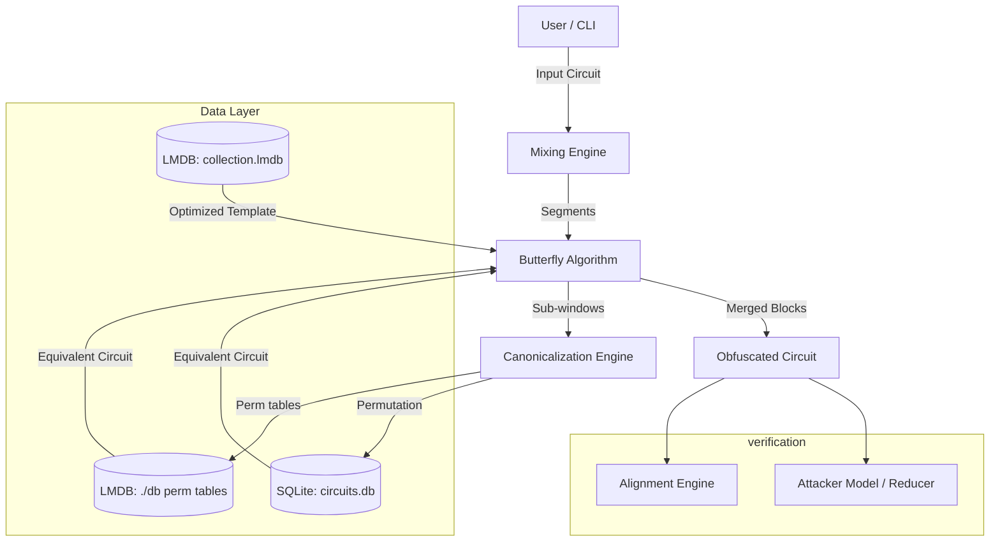

# Local Mixing System Architecture

Note: This document provides a high-level architecture view. Paths have been updated to match the current layout (`src/algorithms/*`, `src/infra/*`). For the full module map and database mapping, see `local_mixing/docs/MASTER_README.md`.

## 1. System Overview

`local_mixing` is a high-performance Rust framework for **Reversible Circuit Obfuscation**. Its primary goal is to take a reversible circuit (e.g., a quantum oracle or classical reversible function) and transform it into a functionally equivalent but structurally complex form that resists automated simplification (reduction).

The system operates on three main pillars:
1.  **Enumeration**: Exhaustively generating small circuits to build "Rainbow Tables" of canonical forms.
2.  **Mixing**: Applying structural transformations (Gadgets, Conjugation) to increase entropy.
3.  **Compression**: Using the Rainbow Tables to locally optimize sub-blocks, ensuring the obfuscated circuit remains efficient (or at least bounded in size).

---

## 2. Core Modules

### A. The Mixing Engine (`src/algorithms/butterfly/mixing.rs`)
The heart of the system. It implements the **Asymmetric Butterfly** algorithm (`abbutterfly`).

**Algorithm Flow:**
1.  **Splitting**: The input circuit is split into parallelizable blocks.
2.  **Wrapping**: Each block $B_i$ is wrapped in a random reversible circuit $R_i$ and its inverse:
    $$ B'_i = R_i^{-1} \cdot B_i \cdot R_{i+1} $$
    *(Note: The boundaries are handled such that $R$ terms cancel out globally, preserving the function).*
3.  **Compression**: Each $B'_i$ is compressed using the TemplateDB or perm-table LMDB (depending on SAT mode and configuration). Since $R_i$ is random, $B'_i$ looks like noise, but the weak "identity" patterns inside $B_i$ are hidden.
4.  **Merging**: Compressed blocks are merged hierarchically.
5.  **Iteration**: The process repeats until the circuit size stabilizes.

### B. Local Mixing (`src/algorithms/annealing/local.rs`)
A stochastic, move-based approach used for smaller-scale mixing or "Simulated Annealing".

**Moves:**
-   **Move A (Insert Template)**: Inserts $P \cdot P^{-1}$ (Identity) at a random position.
-   **Move B (Commute)**: Randomly swaps adjacent commuting gates ($g_1 \cdot g_2 \to g_2 \cdot g_1$).
-   **Move D (Patch-Cancel)**: Inserts $R \dots R^{-1}$ with gates separated by distance.

### C. The Reducer (`src/reducer/budget.rs`)
Acts as the "Attacker Model". It tries to undo the mixing by finding and removing redundancies.
-   **Pass 1**: Adjacent Cancellation ($G \cdot G \to I$).
-   **Pass 2**: Commuting Swaps (to expose adjacent cancellations).
-   **Pass 3**: Template Matching (planned; currently a TODO in this reducer).

### D. Canonicalization (`src/infra/rainbow/`)
Crucial for the "Rainbow Table" lookup.
-   **Problem**: Circuits $A$ and $B$ may look different but be identical ($A \equiv B$).
-   **Solution**: We define a **Canonical Form** $\mathcal{C}(C)$.
-   **Mechanism**: The engine computes the Truth Table (permutation vector) of the circuit and finds the lexicographically smallest wire labeling.
-   **Usage**: When compressing, we compute $H = \text{Hash}(\mathcal{C}(\text{window}))$, then query the DB for the smallest circuit with hash $H$.

---

## 3. Storage Infrastructure
See [DATABASES.md](DATABASES.md) for schema details.

-   **SQLite**: Used for **Enumeration** (building the tables). Maps `Permutation -> Circuit`.
-   **LMDB**: Used for **Synthesis/Lookups**. Maps `Hash -> Template`. Optimized for random read speeds of >1M lookups/sec.

---

## 4. Obfuscation Pipeline (`src/obfuscate/`)
A structured pipeline for applying high-level obfuscation passes.
1.  **Segmentation**: Divide circuit into chunks.
2.  **Gadget Injection**: Insert Commutator Gadgets ($[A, B] = ABA^{-1}B^{-1}$) at boundaries.
3.  **Noise**: Inject unrelated identity patterns to confuse structure.
4.  **Verification**: Fingerprint-based checking to ensure $F(x)$ is preserved.

---

## 5. Verification & Alignment (`src/analysis/alignment/`)
Tools to verify that the obfuscated circuit is "structurally similar" to the original in terms of logical flow, but "locally different".

-   **DTW (Dynamic Time Warping)**: Aligns the "Timeline" of the original circuit with the obfuscated one to visualize where entropy was added.
-   **Trace plot**: Visualizes the state evolution of wires.
